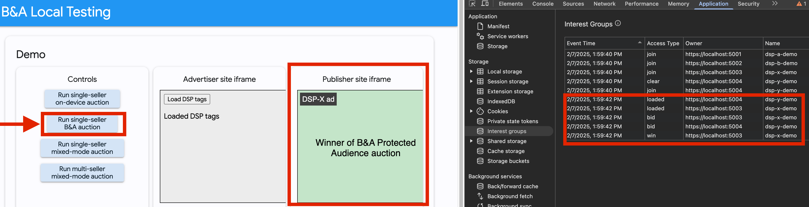

# Hats B&A Demo in Docker compose

This demo shows running B&A on-prem with Hats wrapped inside a docker compose.

## Prerequisite

On both your `Build machine` and `Test machine`, install

-   `git` ( [Install guide](https://git-scm.com/book/en/v2/Getting-Started-Installing-Git) )
-   `docker engine` ( [Public install guide](https://docs.docker.com/engine/install/),
    [Googler cloudtop install guide](go/installdocker) )

On your `Test machine`, ensure `192.168.84.0/24` IP range is free to use and there's no network
interface named `ba-dev`.

## Build Source code

WARN: We recommend more than 64 vCPU and 128 GiB to finish building within 2 hours.

NOTE: Before open sourcing is done, the `Build machine` must be your `Cloudtop` with corp access!

On the `Build machine`, run `./pull_code.sh` to pull the Hats / B&A / B&A local testing app source
code.

Run `./build.sh` to build Hats stack and B&A. This step takes around 80 minutes on a 32 core
machine.

The resulting artifacts are stored in `./build_dependencies/output` folder. It should contain the
following files:

```
invoke
launcher_main
libcddl.so
localhost-key.pem
localhost.pem
stack_a_auction.tar
stack_a_bfe.tar
stack_a_bidding.tar
stack_a_sfe.tar
stack_b_auction.tar
stack_b_bfe.tar
stack_b_bidding.tar
stack_b_sfe.tar
system_bundle.tar
tvs-server_main
```

Once verified, please copy the `./build_dependencies/output` folder to `./run_dependencies/output`
folder. `ls ./run_dependencies/output` should result in the same set of files as above.

## Run the stack

Please transfer `run_dependencies` folder to the `Test machine`. You can do so with

-   SSH: `scp -r <build_machine>:<path to hats-demo>/run_dependencies <test_machine>:~/`
-   Google Drive: Upload `run_dependencies` folder to Google Drive and download it on the `Test machine`.

### Enable required kernel modules

First we need to enable vhost_vsock kernel module.

```
sudo modprobe vhost_vsock
```

### Update stage0 measurement in appraisal policy

Every machine may have different BIOS configuration leading to different stage0 measurement.

Update `run_dependencies/conf/appraisal_policy.prototext` by running `update_stage0_measurement.sh`
inside `run_dependencies/tvs_appraisal_policy_gen/`.

### Optional: Update container binary sha256

In the case that appraisal policy is out of sync with the container runc bundles ( e.g. bfe.tar
files ). We need to update the container binary sha256 field.

Update `run_dependencies/conf/appraisal_policy.prototext` by running
`update_container_binary_sha256.sh` inside `run_dependencies/tvs_appraisal_policy_gen/`.

### Fire up the B&A stack on prem with docker compose

In `run_dependencies` folder, run

```
docker compose up
```

This creates a "ba-dev" docker network bridge for all the traffic at `192.168.84.0/24`. Wait for a
line looks like

```
oak-orchestrator.service: 1742233462.658103477|Http2Client|00000000-0000-0000-0000-000000000000|00000000-0000-0000-0000-000
000000000|00000000-0000-0000-0000-000000000000|external/google_privacysandbox_servers_common/src/core/http2_client/http_connection.cc:operator():187|4: Connection 0x355fffc78710 for host 192.168.84.200 got an err
or. Failed with: The connection was dropped.
```

to show up for `launcher-stack-a-bfe-1`, `launcher-stack-a-sfe-1`, `launcher-stack-b-bfe-1`,
`launcher-stack-b-sfe-1`. It means the stacks are ready to serve traffic. _We're working on
improving the healthcheck monitoring_. You can safely ignore
`oak-agent.service: oak-agent: OTLP error: Metrics error: export timed out`.

### Verify with sample SFE and BFE queries

Once the stacks are running, in `run_dependencies/secure_invoke` folder, run the following commands.
The difference in `bid` and `score` fields are expected.

BFE

```
./bfe-test.sh
```

**Expected output:**

```json
{
    "bids": [
        {
            "bid": 6,
            "render": "https://localhost:5003/ad.html",
            "interestGroupName": "dsp-x-demo"
        }
    ],
    "updateInterestGroupList": {}
}
```

SFE

```bash
./sfe-test.sh
```

**Expected output:**

```json
{
    "adRenderUrl": "https://localhost:5004/ad.html",
    "interestGroupName": "dsp-x-demo",
    "interestGroupOwner": "https://localhost:5004",
    "score": 39,
    "bid": 39,
    "biddingGroups": {
        "https://localhost:5003": { "index": [0] },
        "https://localhost:5004": { "index": [0] }
    }
}
```

## Verify with Chrome

First, install and trust the SSL root certiticate on the machine you're running Chrome. In
`run_dependencies/output`, install `localhost.pem` on the machine with Chrome.

There are many instructions online to do the installation:

-   Ubuntu:
    https://documentation.ubuntu.com/server/how-to/security/install-a-root-ca-certificate-in-the-trust-store/index.html
-   MacOS:
    https://support.apple.com/guide/keychain-access/add-certificates-to-a-keychain-kyca2431/mac

Then, open Chrome with the following flags enabled to utilize the locally served public keys and
Privacy Sandbox Ads API features:

**On Linux:**

```bash
google-chrome --enable-privacy-sandbox-ads-apis --disable-features=EnforcePrivacySandboxAttestations,FledgeEnforceKAnonymity --enable-features=FledgeBiddingAndAuctionServerAPI,FledgeBiddingAndAuctionServer:FledgeBiddingAndAuctionKeyURL/http%3A%2F%2Flocalhost%3A9999
```

**On Mac:**

```bash
open /Applications/Google\ Chrome.app/ --args --enable-privacy-sandbox-ads-apis --disable-features=EnforcePrivacySandboxAttestations,FledgeEnforceKAnonymity --enable-features=FledgeBiddingAndAuctionServerAPI,FledgeBiddingAndAuctionServer:FledgeBiddingAndAuctionKeyURL/http%3A%2F%2Flocalhost%3A9999
```

**SSH Tunneling (for remote Test Machine):**

If the Test Machine is running remotely (e.g., on a separate Mac machine), establish an SSH tunnel
to forward the necessary ports:

```bash
ssh -L 9999:localhost:9999 -L 3000:localhost:3000 -L 4001:localhost:4001 -L 4002:localhost:4002 -L 5001:localhost:5001 -L 5002:localhost:5002 -L 5003:localhost:5003 -L 5004:localhost:5004 -L 6004:localhost:6004 -L 6003:localhost:6003 -L 6002:localhost:6002 -L 6001:localhost:6001 <Test machine address>
```

In Chrome, open a
[Guest Profile](https://support.google.com/chrome/answer/6130773?hl=en&co=GENIE.Platform%3DDesktop).
And then open `localhost:3000`.

 Figure 1: Right click on the page and select "Inspect" to open Developer
Console. Then click on "Application" tab on the top, "Interest groups" on the left under "Storage"
section.

 Figure 2: Click on "Load DSP Tags" and you should see that you're added into
certain "interest groups" on the right.

 Figure 3: Click on "Run single-seller B&A auction" and you should see "Publisher
site iframe" shows a "Winner" representing an Ad winning the B&A process.

 Figure 4: Click on "Run single seller Mixed model auction", similar to Figure 3,
it should have an ad, and relevant interest group changes.

 Figure 5: Click on "Run multi seller Mixed model auction", similar to Figure 3,
it should have an ad, and relevant interest group changes.
