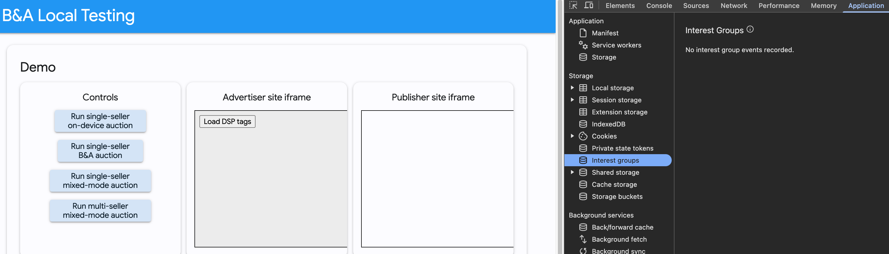
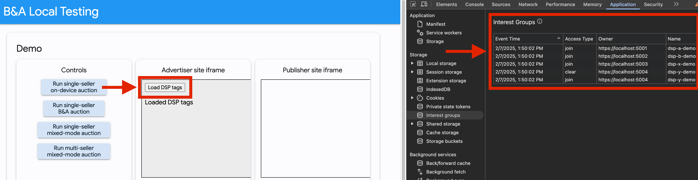
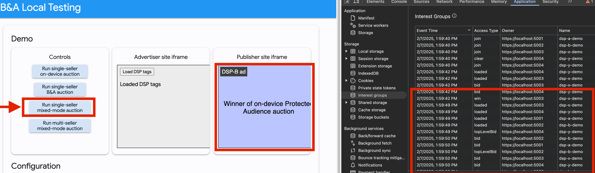
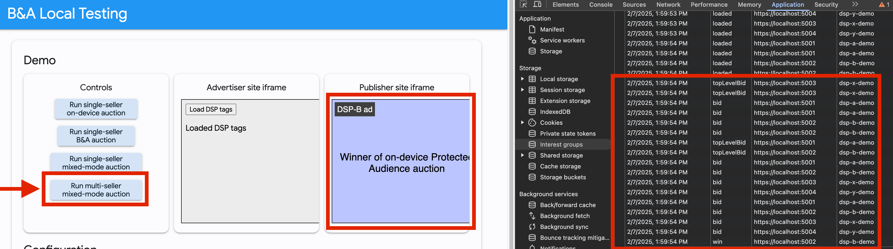

# Hats Demo - Bidding and Auction on-prem

## Overview

This document outlines the steps to set up and run a demonstration of the Bidding and Auction (B&A)
system using the Hats framework. This demo showcases the B&A server functionality within a Hardware
Attested Trusted Execution Environment (TEE) on a local machine. The demo utilizes local attestation
through a Trusted VM Server (TVS).

## Prerequisites

-   **Build Machine:** A machine capable of generating the demo folder with necessary scripts and
    the Hats and B&A stacks.
-   **Test Machine (SEV-SNP Device):** A machine with a SEV-SNP enabled processor to run the demo in
    a secure and attested environment.
-   **Chrome Browser:** The latest version of Chrome to test the B&A functionality.

## Demo Setup

### Prepare the Build Machine Dependencies

On your build machine, you need to setup docker version>=20.10.21
[instruction](https://docs.docker.com/engine/install/), Nix following
[oak nix setup instructions](https://github.com/project-oak/oak/blob/main/docs/development.md#install-nix),
and bazel (B&A requires 6.3.0, Hats requires 7.4.1) through
[bazelisk latest](https://github.com/bazelbuild/bazelisk?tab=readme-ov-file#installation).

In the case that sudo is required to run docker, please follow
[docker sudoless instruction](https://docs.docker.com/engine/install/linux-postinstall/#manage-docker-as-a-non-root-user).

### Build the Demo Folder

NOTE: The build process can take up to 2 hours to finish on a 16 core VM.

Execute the following script to generate the `demo` folder, which contains all required setup
scripts, Hats stack, and B&A stack components.

```bash
./build.sh
```

If you see the line `demo.tar: OK`, it's finished successfully.

**build.sh Details:**

This script performs the following actions:

1.  **Prepare Demo Directory:**
    -   Creates a `demo` directory.
    -   Copies the contents of the `skeleton` directory into the `demo` directory.
2.  **Update Submodules:**
    -   Updates the Git submodules for the `hats` and `bidding-auction-server` components.
    -   In the `hats` submodule, it checks out a specific commit hash
        (`8abb7e99106e4cc1af1cc5433657fd98e617bf8f`) to ensure a stable demo environment.
    -   In the `bidding-auction-server` submodule, it fetches and checks out a specific pending CL
        (`refs/changes/58/2413458/11`) for the B&A server.
3.  **Build Hats Stack:**
    -   Navigates to the `components/hats/client/scripts/` directory.
    -   Builds the Hats launcher, TVS, and test key generator using the `build-lib.sh` script.
    -   Builds Oak containers for stage0, stage1, kernel, syslogd, and Hats containers.
    -   Creates a `tar` archive of the built components.
    -   Moves the built binaries to the `demo/ba_hats_stack/`, `demo/tvs/` and `demo/` directories.
4.  **Build B&A Demo Stack:**
    -   Navigates to the `components/bidding-auction-server` directory.
    -   Uses the `build_and_test_all_in_docker` script to build BFE, Bidding, Auction, and SFE
        services for two instances, `hats` and `hatsb`.
    -   Copies the built `dist` folders into `demo/ba_hats_stack/stack_a` and
        `demo/ba_hats_stack/stack_b`.
5.  **Package Demo:**
    -   Creates a tar archive of the `demo` directory.
    -   Generates a SHA256 checksum of the archive.

### Prepare the Test Machine Dependendencies

Transfer the generated `demo` folder from the build machine to the test machine (the SEV-SNP
device). You can use `scp` to do copying.

### Setup the Environment on the Test Machine

NOTE: This setup step takes around 10 minutes on a 32 core CPU if trying to compile QEMU.

On the test machine, navigate to the `demo` folder and run the setup script, which setup the test
machine dependencies.

```bash
cd demo
./setup.sh
```

**setup.sh Details:**

This script performs the following actions:

1.  **Environment Setup:**
    -   Sets the `VCPU_COUNT` to 2.
    -   Defines the `DEMO_DIR`, `TEST_CLIENT_DIR`, and `SETUP_DIR` variables.
    -   Creates the `SETUP_DIR` if it doesn't exist.
2.  **Setup Docker:**
    -   Checks if Docker is installed. If not, installs it along with `containerd`,
        `docker-buildx-plugin`, `docker-ce`, `docker-ce-cli`, `docker-ce-rootless-extras`, and
        `docker-compose-plugin` using `dnf`.
    -   Starts the Docker service and runs a simple ping test to validate the installation.
3.  **Setup Bazel:**
    -   Checks if Bazel is installed. If not, installs it using `bazelisk` and creates the necessary
        symlink.
4.  **Setup QEMU:**
    -   Checks if QEMU is installed. If not, installs it using `yum`, `pip`, and `wget`.
    -   Downloads and builds QEMU from source.
    -   Installs QEMU to `/usr/local/bin`.
5.  **Setup Host Machine:**
    -   Loads the `vhost_vsock` kernel module.
    -   Installs `sevctl` and `libcurl-devel` using `dnf`.
    -   Checks for SNP support using `sevctl`. Exits if the host does not support SNP.
6.  **Setup Test Client:**
    -   Clones the `bidding-auction-servers` and `bidding-auction-local-testing-app` repositories
        from GitHub.
    -   Runs the `setup` script within the `bidding-auction-local-testing-app` repository.
    -   Prints a message instructing the user to add the local SSL certificate for Chrome to trust.
7.  **Setup TVS Keys:**
    -   Generates noise KK keys, HPKE keys, and authentication keys using the `key-gen` tool.
    -   Stores the generated keys in the appropriate files in the `tvs` and `ba_hats_stack`
        directories.
8.  **Setup TVS Appraisal Policy:**
    -   Clones the `sev-snp-measure` and `snphost` repositories from GitHub.
    -   Generates the stage0 measurement using the `sev-snp-measure.py` script, based on the system
        bundle and the host's CPU information.
    -   Retrieves the SNP, Boot Loader, and Microcode versions using `snphost`.
    -   Outputs the `appraisal_policy.prototext` content with the retrieved values.

**Manual Step:**

1.  **Install Local SSL Certificate:** On the machine running Chrome, install the locally signed SSL
    certificate `bidding-auction-local-testing-app/certs/localhost.pem`. This certificate is
    required for Chrome to securely communicate with the local B&A stack.
2.  **Skip if Chrome is on the same Machine:** If you are running Chrome on the test machine where
    `setup.sh` was executed, you can skip this step.
3.  **Install on MacOS:** For MacOS, follow these instructions to install the certificate:
    [MacOS](https://support.apple.com/guide/keychain-access/add-certificates-to-a-keychain-kyca2431/mac)

### Launch the B&A Local Testing Application

This application serves the bidding and auction logic, KV server functionality, and a webserver for
loading the Chrome page.

Navigate to the `test_client/bidding-auction-local-testing-app` folder and execute the following
command.

```bash
cd test_client/bidding-auction-local-testing-app
./start-web
```

### Launch the Local TVS and Public Key Endpoint

In the `tvs` folder, execute the following scripts:

```bash
cd tvs
./launch-tvs.sh
./launch-local-public-key-server.sh
```

### Launch the B&A Stacks

The demo utilizes two B&A stacks, `stack_a` and `stack_b`, located in the `./ba_hats_stack/` folder.
These stacks contain BFE (Bidding Frontend), Bidding, Auction, and SFE (Seller Frontend) services.
This script runs one stack at a time. The output shows the stdout and stderr folders.

```bash
./launch-stack.sh stack_a
```

```bash
./launch-stack.sh stack_b
```

### 7. Test the BFE and SFE

Navigate to the `./test_client/` folder and run the following tests:

```bash
cd test_client
./bfe-test.sh
```

**Expected output:**

```json
{
    "bids": [
        {
            "bid": 6,
            "render": "https://localhost:5003/ad.html",
            "interestGroupName": "dsp-x-demo"
        }
    ],
    "updateInterestGroupList": {}
}
```

And:

```bash
./sfe-test.sh
```

**Expected output:**

```json
{
    "adRenderUrl": "https://localhost:5004/ad.html",
    "interestGroupName": "dsp-x-demo",
    "interestGroupOwner": "https://localhost:5004",
    "score": 39,
    "bid": 39,
    "biddingGroups": {
        "https://localhost:5003": { "index": [0] },
        "https://localhost:5004": { "index": [0] }
    }
}
```

### 8. Test with Chrome

Open Chrome with the following flags enabled to utilize the locally served public keys and Privacy
Sandbox Ads API features:

**On Linux:**

```bash
google-chrome --enable-privacy-sandbox-ads-apis --disable-features=EnforcePrivacySandboxAttestations,FledgeEnforceKAnonymity --enable-features=FledgeBiddingAndAuctionServerAPI,FledgeBiddingAndAuctionServer:FledgeBiddingAndAuctionKeyURL/http%3A%2F%2Flocalhost%3A9999
```

**On Mac:**

```bash
open /Applications/Google\ Chrome.app/ --args --enable-privacy-sandbox-ads-apis --disable-features=EnforcePrivacySandboxAttestations,FledgeEnforceKAnonymity --enable-features=FledgeBiddingAndAuctionServerAPI,FledgeBiddingAndAuctionServer:FledgeBiddingAndAuctionKeyURL/http%3A%2F%2Flocalhost%3A9999
```

**SSH Tunneling (for remote Test Machine):**

If the Test Machine is running remotely (e.g., on a separate Mac machine), establish an SSH tunnel
to forward the necessary ports:

```bash
ssh -L 9999:localhost:9999 -L 3000:localhost:3000 -L 4001:localhost:4001 -L 4002:localhost:4002 -L 5001:localhost:5001 -L 5002:localhost:5002 -L 5003:localhost:5003 -L 5004:localhost:5004 -L 6004:localhost:6004 -L 6003:localhost:6003 -L 6002:localhost:6002 -L 6001:localhost:6001 <SNP address>
```

**Note:** Chrome must trust the localhost HTTPS certificates, as outlined in the "Install Local SSL
Certificate" step.

**Note:** Everytime you regenerate the bidding-auction-local-testing-app/certs folder by running the
setup.sh script, you'll need to redo the "Install Local SSL Certificate" step.

**Note:** Everytime you regenerate the HPKE public keys by running the setup.sh script, you'll need
to restart Chrome by killing all Chrome processes.

In Chrome, open a
[Guest Profile](https://support.google.com/chrome/answer/6130773?hl=en&co=GENIE.Platform%3DDesktop).
And then open `localhost:3000`.

 Figure 1: Right click on the page and select "Inspect" to open Developer
Console. Then click on "Application" tab on the top, "Interest groups" on the left under "Storage"
section.

 Figure 2: Click on "Load DSP Tags" and you should see that you're added into
certain "interest groups" on the right.

 Figure 3: Click on "Run single-seller B&A auction" and you should see "Publisher
site iframe" shows a "Winner" representing an Ad winning the B&A process.

 Figure 4: Click on "Run single seller Mixed model auction", similar to Figure 3,
it should have an ad, and relevant interest group changes.

 Figure 5: Click on "Run multi seller Mixed model auction", similar to Figure 3,
it should have an ad, and relevant interest group changes.
